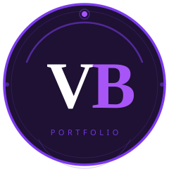
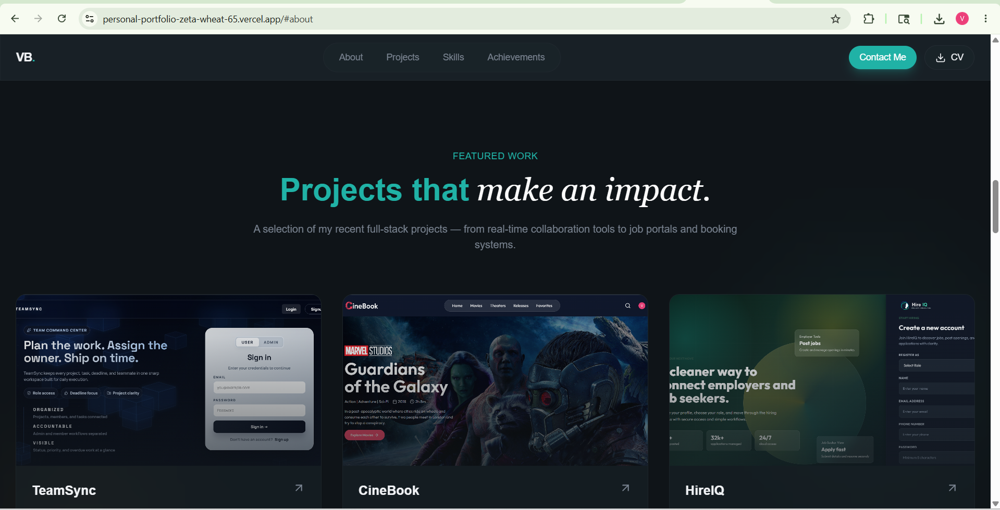

<div align="center">



# Vaibhav Baishkhiyar - Personal Portfolio

**Full Stack Developer | MERN Stack | React.js | Node.js**

[](https://your-portfolio-url.vercel.app)
[](https://www.linkedin.com/in/vaibhav-baishkhiyar108/)
[](https://github.com/vaibhav1-prog)

</div>

---

## Preview

Add a screenshot after deployment:

```md

```

---

## Features

- Modern dark UI with glassmorphism, teal accents, and smooth animations
- Typing animation in the hero section
- Fully responsive layout for mobile, tablet, and desktop
- Project showcase for TeamSync, CineBook, and HireIQ
- Skills section with animated skill bars
- About and education section with stats
- Achievements and certifications carousel
- EmailJS-powered contact form
- Custom VB logo and favicon
- Resume download button

---

## Tech Stack

| Category | Technologies |
| --- | --- |
| Frontend | React.js 19, Vite, Tailwind CSS v4 |
| Icons | Lucide React |
| Email | EmailJS |
| Deployment | Vercel |
| Package Manager | npm |

---

## Getting Started

### Prerequisites

Install these before running the project:

- [Node.js](https://nodejs.org/) v18 or higher
- [Git](https://git-scm.com/)
- npm, which comes with Node.js

### 1. Clone the repository

```bash
git clone https://github.com/vaibhav1-prog/Personal-Portfolio.git
```

### 2. Go into the project folder

```bash
cd Personal-Portfolio
```

### 3. Install dependencies

```bash
npm install
```

### 4. Set up environment variables

Create a local `.env` file from the example file:

```bash
cp .env.example .env
```

On Windows PowerShell, you can use:

```powershell
Copy-Item .env.example .env
```

Then update `.env` with your EmailJS credentials:

```env
VITE_EMAILJS_SERVICE_ID=your_service_id_here
VITE_EMAILJS_TEMPLATE_ID=your_template_id_here
VITE_EMAILJS_PUBLIC_KEY=your_public_key_here
```

You can get these values from your [EmailJS](https://www.emailjs.com/) dashboard.

### 5. Run the project locally

```bash
npm run dev
```

Open the local URL shown in the terminal, usually:

```text
http://localhost:5173
```

### 6. Build for production

```bash
npm run build
```

### 7. Preview the production build

```bash
npm run preview
```

---

## Project Structure

```text
vaibhav-portfolio-final/
|-- public/
|   |-- projects/
|   |-- Vaibhav_Baishkhiyar_Resume.pdf
|   |-- hero-bg.jpg
|   |-- profile-photo.jpg
|   |-- vb-logo.svg
|   `-- vite.svg
|-- src/
|   |-- components/
|   |-- layout/
|   |-- sections/
|   |   |-- About.jsx
|   |   |-- Contact.jsx
|   |   |-- Hero.jsx
|   |   |-- Projects.jsx
|   |   |-- Skills.jsx
|   |   `-- Testimonials.jsx
|   |-- App.jsx
|   |-- index.css
|   `-- main.jsx
|-- .env.example
|-- .gitignore
|-- eslint.config.js
|-- index.html
|-- package.json
`-- vite.config.js
```

---

## Deployment

This project is ready to deploy on Vercel.

1. Push the project to GitHub.
2. Open [Vercel](https://vercel.com/) and import the repository.
3. Add the same EmailJS variables from `.env` in the Vercel environment settings.
4. Use the default Vite settings:
   - Build command: `npm run build`
   - Output directory: `dist`
5. Deploy the project.

---

## Customization

| What to change | File |
| --- | --- |
| Name, bio, and hero text | `src/sections/Hero.jsx` |
| About content and education | `src/sections/About.jsx` |
| Projects, links, and tags | `src/sections/Projects.jsx` |
| Skills and proficiency values | `src/sections/Skills.jsx` |
| Contact details | `src/sections/Contact.jsx` |
| Social links | `src/sections/Hero.jsx`, `src/layout/Footer.jsx` |
| Profile photo | `public/profile-photo.jpg` |
| Resume PDF | `public/Vaibhav_Baishkhiyar_Resume.pdf` |
| Project screenshots | `public/projects/` |

---

## License

This project is open source and available under the [MIT License](LICENSE).

---

<div align="center">

Built by **Vaibhav Baishkhiyar**

Star this repository if you found it helpful.

</div>
